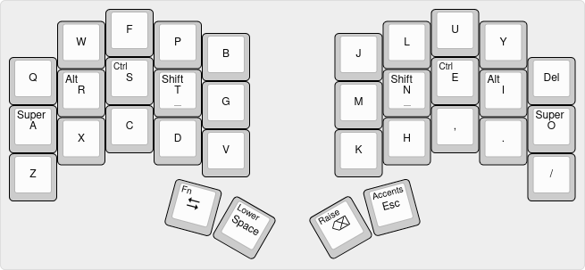
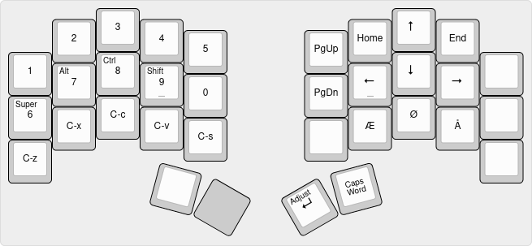
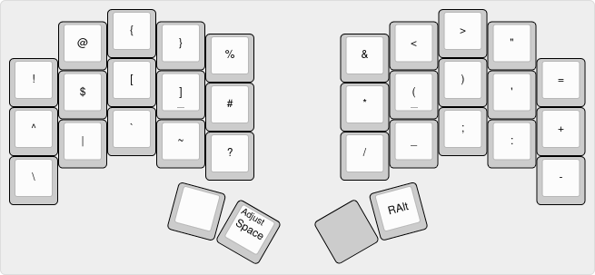
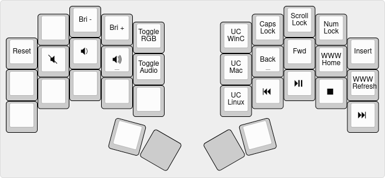
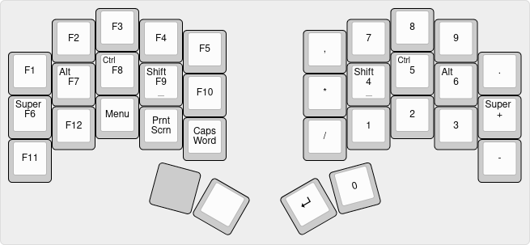
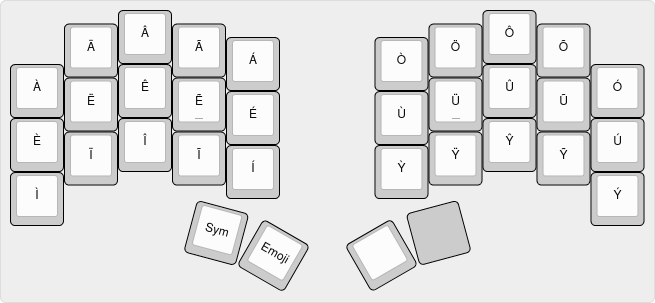
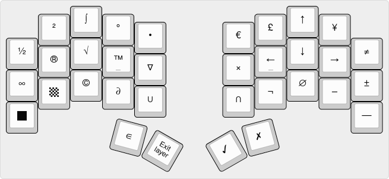
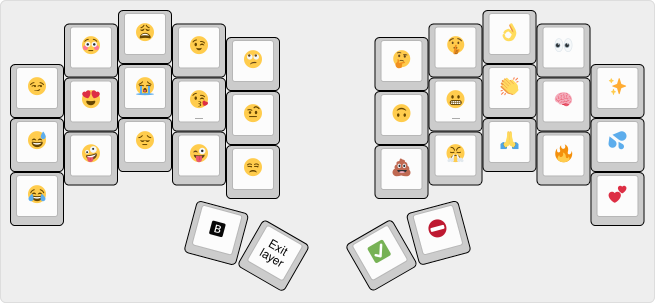

# janusvm's keymap for the Ferris Sweep

The Ferris Sweep is a 34 key, split, column staggered keyboard that you build yourself.
After iterating on the [Planck keymap](/planck) for about 1½ years, I've arrived on a set of features and properties that I find comfortable in a keyboard, and the Ferris Sweep fits that set perfectly.
This keymap as such features:

* [Colemak-DH](https://colemakmods.github.io/mod-dh) base layout
* [Home row mods](https://precondition.github.io/home-row-mods)
* Support for Danish characters (Æ, Ø, Å), accented vowels, and other unicode symbols I tend to use
* Programming-friendly placement of non-alphas that require at most one modifier or layer key to be held to reach
* Comfortable access to key combinations I would commonly use in my day-to-day work (mostly in Emacs and IntelliJ IDEA with Vim bindings)

The layer configuration is based on having the system keyboard set to a US QWERTY layout.
While this requires a bit of (sometimes awkward) workarounds for typing Danish letters, since I mostly type in English, I don't mind too much.

## Base

The base layer contains all the alphas except ÆØÅ, arranged in the matrix version [Colemak-DH](https://colemakmods.github.io/mod-dh) layout, with the top right semicolon key replaced with Delete for easier access.

Modifier keys are placed on the home row on both sides, as [Mod-Tap](https://docs.qmk.fm/#/mod_tap) (dual purpose) keys.
Letter keys when tapped, modifier keys when held.
The main layer keys, LOWER and RAISE, also serve dual purposes as Space and Backspace, respectively.
Ditto for the Tab key, which when held activates the Fn layer, and the Esc key, which activates the Accents layer.

### Tapping behaviour

The timing and behaviour of the home row Mod-Tap keys are tuned differently for each finger; the index and longfinger have shorter `TAPPING_TERM` than the ringfinger and pinky.
The former also have `PERMISSIVE_HOLD` enabled, while the latter don't.
This means that the Alt and Super keys requires to be held more deliberately, while the Shift and Ctrl key can be activated if another key is quickly tapped while they are held.
The `HOLD_ON_OTHER_KEY_PRESS` option is on for just thumb keys, meaning that they activate their layer function as soon as another key is hit, 

## Lower

The Lower layer serves three overall purposes: navigation, ÆØÅ, and numbers.

Having the numbers arranged in a 2x5 grid instead of in a single row all the way across the keyboard makes them easier to type in my opinion, as they're reachable one-handed.

Arrow keys are placed in a T-block formation rather than a Vim-like row, as it feels more natural — using HJKL for navigation only makes sense to me if you're stuck with a larger QWERTY keyboard.
The other navigation keys are positioned such that their relative position makes sense intuitively.

Since the right home row is used for navigation, ÆØÅ keys are placed just below it.
On a standard Danish QWERTY keyboard, ÆØÅ are all reached with the pinky, which I wanted to avoid.

Finally, the Lower layer is also where you'll find the Enter key.
I've found that I don't really need it more readily than the other base layer thumb keys.

## Raise

The Raise layer has standard special characters usually available on a regular keyboard, placed such that:

* Bracket delimiters (`() [] {} <>`) are available at the prime spots for paired keys.
While most editors automatically insert the closing bracket, I tend to use paired brackets in navigation-related keybindings, so I need opening and closing brackets next to each other.
* Several symbols (`! @ % & = - \`) are at or close to their usual position on an ISO Danish keyboard
* Certain symbols that pair up in Emacs and Vim-like keybindings (`^ $`, `# *`, `? /`, and `= + -`) are placed together (or opposite of each other).

Additionally, this layer has a Right Alt key, since I use this key for the Compose key in Linux and WinCompose.
While there are no home row mods on this layer (technical limitation), I don't think I ever use the left Alt and Ctrl keys anyway.
It seems to work to hold down the mod key before the Raise key, for keystroke combinations involving modifiers and symbols.

## Adjust

The Adjust layer, reached by holding Lower and Raise simoultaneously, has lock keys, keys for adjusting settings, and some media keys:
* The RESET button enters the bootloader on the board, for flashing the keymap.
* The Brightness and Volume buttons adjust the computer's system settings for these things.
* The Toggle RGB and Toggle Audio toggle these features on the keyboard.
* The UC keys are for setting the unicode input mode, which is dependent on the OS and can't be automatically detected, sadly. On Windows, this uses WinCompose for inputting characters.
* The Back and Forward keys are actually mouse buttons 4 and 5 (as opposed to direct Browser Back and Forward keys), as these have a function in IDEA.

## Fn

The Fn layer has F-keys, a numpad arrangement of numbers, and some extra keys that I tend to use:
* The Menu (or Application) key brings up the context menu on Windows, but it also doubles as `M-x` in Emacs, which I use very often.
* Print screen to take a screenshot.
* Caps Word is a version of Caps Lock that is only active for the next word.

The numpad uses the numpad-specific keycodes, except for `,` and `.`, which use the regular comma and dot keycodes (as their numpad counterparts did not seem to work for me).

## Accents

The Accents layer has accented vowels, since setting the OS keyboard to US English means I don't have the accent dead keys available.
It also has one-shot layer keys for the Symbols and Emoji layers.

## Symbols

The Symbols layer has various unicode characters that I use relatively regularly.

## Emoji

The Emoji layer has quick access to my favourite emoji.
