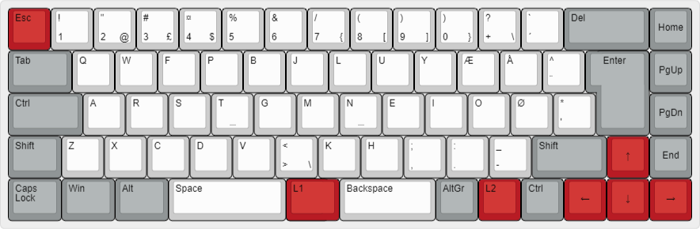

# janusvm's keymap for the KBD67 rev2

This keymap fits the soldered version of the KBDfans KBD67 rev2 with ISO layout and split spacebar.

## Base layer

The base layout is based on Danish ISO, using the [Colemak-DH](https://colemakmods.github.io/mod-dh/) layout with the angle mod.