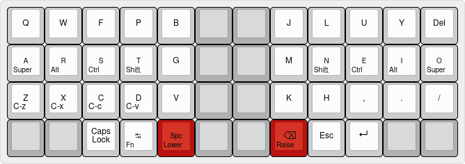

# janusvm's keymap for the OLKB Planck

<!--
The Planck was my first foray into QMK and customizing the layout of a keyboard beyond just rebinding a key or two.
Over time, as I have uncovered what I really want from a keyboard, this layout has become very sharply tailored to those needs, and as such feature:

* [Colemak-DH](https://colemakmods.github.io/mod-dh) base layout
* [Home row mods](https://precondition.github.io/home-row-mods)
* Wide, pseudo-split arrangement of alphas
* Support for Danish characters (Æ, Ø, Å)
* Programming-friendly placement of non-alphas that require at most one modifier or layer key to be held to reach
* RGB indication of layer status

The layer configuration is based on having the system keyboard set to a US QWERTY layout.
While this requires a bit of (sometimes awkward) workarounds for typing Danish letters, since I mostly type in English, I don't mind too much.

## Base

The base layer contains all the alphas except ÆØÅ, arranged in the matrix version [Colemak-DH](https://colemakmods.github.io/mod-dh) layout, with the top right semicolon key replaced with Delete for easier access.

Instead of having an outer edge of modifier keys, the layout is "split" in half down the middle and moved one column outwards.
This gives an ever-so-slightly more ergonomic typing experience — not quite on the level of a true, split keyboard, when it comes to shoulder position, but the reduced usage of the pinkies is quite noticable.

Modifier keys are placed on the home row on both sides, as [Mod-Tap](https://docs.qmk.fm/#/mod_tap) (dual purpose) keys.
Letter keys when tapped, modifier keys when held.
The timing and behaviour of these Mod-Tap keys are tuned differently for each finger; the index and longfinger have shorter `TAPPING_TERM` than the ringfinger and pinky.

The main layer keys, LOWER and RAISE, also serve dual purposes as Space and Backspace, respectively.
Ditto for the Tab key, which when held activates the Fn layer.

## Lower

The Lower layer serves three overall purposes: navigation, ÆØÅ, and numbers.

Having the numbers arranged in a 2x5 grid instead of in a single row all the way across the keyboard makes them easier to type in my opinion, as they're reachable one-handed.

Arrow keys are placed in a T-block formation rather than a Vim-like row, as it feels more natural — using HJKL for navigation only makes sense to me if you're stuck with a larger QWERTY keyboard.
The other navigation keys are positioned such that their relative position makes sense intuitively.

Since the right home row is used for navigation, ÆØÅ keys are placed just below it.
On a standard Danish QWERTY keyboard, ÆØÅ are all reached with the pinky, which I wanted to avoid.

## Raise

The Raise layer has standard special characters usually available on a regular keyboard, placed such that:

* Bracket delimiters (`() [] {} <>`) are available at the prime spots for paired keys.
While most editors automatically insert the closing bracket, I tend to use paired brackets in navigation-related keybindings, so I need opening and closing brackets next to each other.
* Several symbols (`! @ % & = \`) are at or close to their usual position on an ISO Danish keyboard
* Certain symbols that pair up in Emacs and Vim-like keybindings (`^ $`, `# *`, and `= + -`) are placed together

Additionally, this layer has a Right Alt key, since I use this key for the Compose key in Linux and WinCompose.
While there are no home row mods on this layer (technical limitation), I don't think I ever use the left Alt and Ctrl keys anyway.
It seems to work to hold down the mod key before the Raise key, for keystroke combinations involving modifiers and symbols.

## Adjust

The Adjust layer, reached by holding Lower and Raise simoultaneously, has mouse keys, keys for adjusting settings, and some media keys:
* The Qwerty and Colemak-DH button toggles the persistent base layer between QWERTY and Colemak-DH layout.
This is basically deprecated functionality, as I never use QWERTY anymore.
* The Brightness and Volume buttons adjust the computer's system settings for these things.
* The Toggle RGB and Toggle Audio toggle these features on the keyboard.
* The other special keys are Mail, Calculator, Browser, and File Explorer.
* RESET and DEBUG are for developing the keymap.
* The UC keys are for setting the unicode input mode, which is dependent on the OS and can't be automatically detected, sadly. On Windows, this uses WinCompose for inputting characters.
* The mouse keys are placed such that they match the arrow keys on the Lower layer, with mouse button 1-4 placed where it makes sense.

-->
