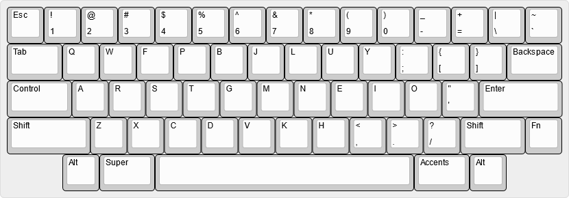
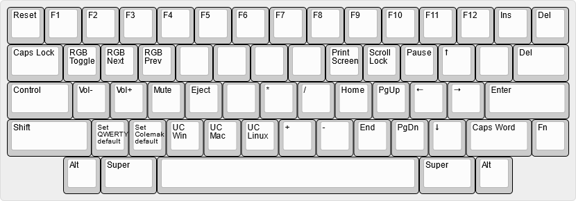

# janusvm's keymap for the Tokyo60

The Tokyo60 is a 60% HHKB style keyboard, and I wanted to keep the keymap as close to the [original HHKB layout](https://hhkb.io/layout/) while adding some personal necessities.
The keymap is designed to be used with a US ANSI layout at the system level.

## Base (QWERTY)

The standard HHKB layout, with Backspace instead of Delete, and a oneshot layer key for the Accents layer.
Both Alt keys are Left Alts, as I use Right Alt as a compose key.

## Base (Colemak-DH)

Same as the QWERTY layer, but with alphas arranged in the Colemak-DH layout.

## Fn

Function layer of the HHKB with added controls for RGB lighting and toggles for the base layout and unicode input method.

## Accents

Given that the keymap is based on US ANSI, I need some other way to input Danish vowels (ÆØÅ) and accented characters.
This layer, accessed via a oneshot key, has quick access to all of these.
In addition, the right Alt key on this layer is indeed a Right Alt, which I use as a compose key for inputting arbitrary unicode characters.
